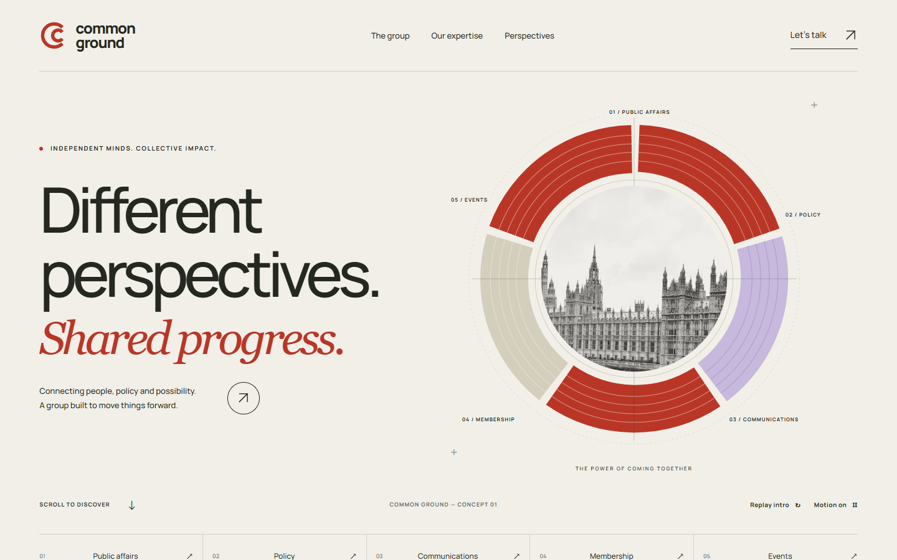
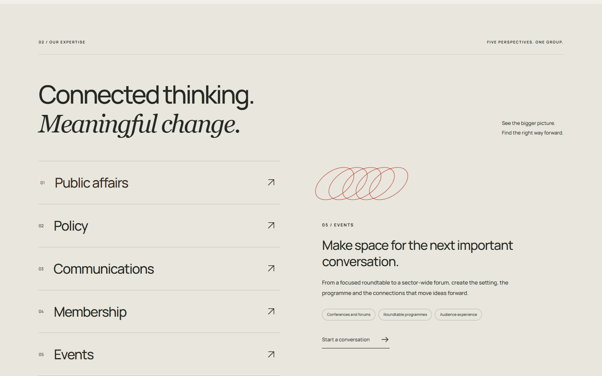
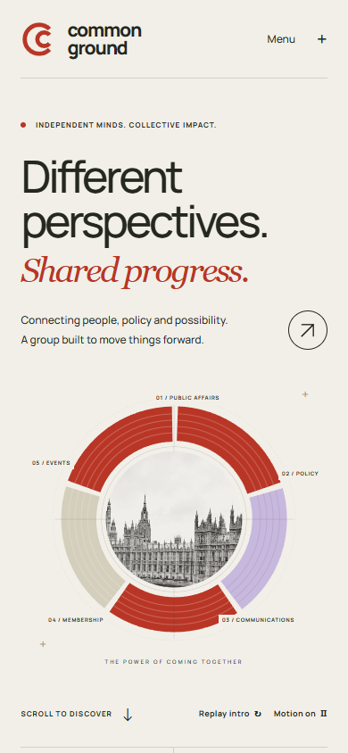

# COMMON GROUND

**Different perspectives. Shared progress.** An independent corporate website concept: five disciplines assemble into one graphic circle, then flow into a complete editorial homepage.

[Explore the website](https://16-common-ground.williamking.workers.dev) · [Standalone animated hero](https://16-common-ground.williamking.workers.dev/hero.html) · [Integration guide](HERO-INTEGRATION.md)



## The idea

Public affairs, policy, communications, membership and events share the same visual space. Five original SVG forms converge around architectural photography; large Manrope typography and a warm serif accent give the opening a precise, human tone. Vermilion, ivory and lilac continue through the homepage rather than stopping at the hero.

The opening takes about three seconds and settles. Scroll reveals carry the circle and typography into the introduction, five-discipline explorer, editorial perspectives and local project-brief builder. Native scrolling stays intact. Motion can be disabled, and the system reduced-motion preference produces the complete static composition.

| Desktop | Phone |
|---|---|
|  |  |

## Try it

- Replay the opening, or switch motion off.
- Select each discipline to explore its positioning and services.
- Open either perspective, read the full concept note, and dismiss with Escape.
- Prepare a brief, then copy or download it. No personal data is requested and nothing is sent.
- Open the standalone hero to see the integration-ready version without the homepage.

This is speculative portfolio work by William King, created around a fictional brand, not a commissioned client result. The identity, artwork and copy are original demonstration material. The photographs illustrate the sector and do not claim client work or endorsement.

## Build and verify

Requires Bun 1.3.10 and Node 24.21.0. All dependency versions are pinned in `package.json` and `bun.lock`.

```sh
bun install --frozen-lockfile
bun run dev               # loopback :4526
bun run check             # strict TypeScript, Biome, production build
bun run preview           # loopback :4626
bun run verify:browser    # separate terminal, installed Google Chrome
bun run deploy            # full checks, then authenticated Cloudflare upload
node tools/verify-release.mjs https://16-common-ground.williamking.workers.dev
```

Vite + React + TypeScript + GSAP + Tailwind + Lightning CSS. No WebGL, autoplay video, backend or runtime CDN calls. The complete homepage is prerendered. The separate hero is plain HTML/CSS/JavaScript and does not load React. All runtime assets and dependencies are local to this repository.

`src/Hero.tsx` is the markup source; `src/motion.ts` owns timeline setup and cleanup; `src/hero.css` scopes the reusable visual identity. `src/App.tsx` contains the small homepage interaction layer and `src/content.ts` owns content. The static build emits both `/` and `/hero.html`. Follow [HERO-INTEGRATION.md](HERO-INTEGRATION.md) for CMS and React use.

Stylesheet specificity linting is disabled only for `noDescendingSpecificity`, because component classes intentionally share tag names across responsive blocks. Other recommended lint rules remain active. The source uses scoped resets instead of important overrides.

## Evidence and provenance

[Two-concept delivery](docs/DELIVERY.md) · [Design](DESIGN.md) · [Visual profile](docs/visual/PROJECT_PROFILE.md) · [Verification](docs/VERIFICATION.md) · [Release](docs/RELEASE.md) · [Asset manifest](assets.manifest.json)

Browser evidence covers six desktop/tablet/phone/landscape viewports, keyboard, modal focus, all five disciplines, brief validation/export, reduced motion, preference changes, the standalone hero and no-JavaScript reading. It is implementer self-review on local Chrome, not independent/client approval or physical-phone certification. Motion captures are sampled states.

London photograph: [Maik Winnecke](https://unsplash.com/photos/the-houses-of-parliament-and-big-ben-in-london-v3nbIVKiETU). Conference photograph: [Marwen Larafa](https://unsplash.com/photos/speaker-presenting-to-a-large-audience-in-an-auditorium-qzO9a6oQ8AM). Both use the [Unsplash License](https://unsplash.com/license), with source, processing and hashes recorded in the manifest. Manrope is by the Manrope Project Authors under [SIL OFL 1.1](public/fonts/OFL-Manrope.txt). Vector artwork is original to this concept.
